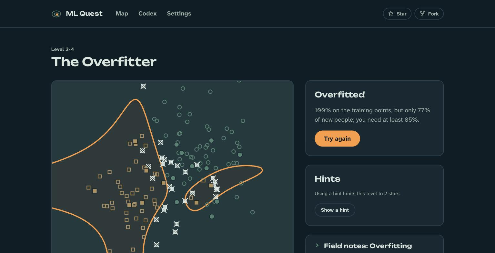

# ML Quest

**Learn machine learning by training real models to beat levels.** Free, open source, and it runs entirely in your browser.

### ▶ [Play ML Quest](https://amide-init.github.io/ml-quest/)



Every level is a puzzle with a real model in it. You drag the data, tune the learning rate or reshape the model, watch it learn live, and pass only when it actually works on data it hasn't seen. You can't click through text to win.

- **Play first, name it after.** You feel an idea in the level, and the debrief gives it its real name. Optional field notes explain the idea and the controls if you'd rather read first.
- **Real models, trained live:** gradient descent, linear and logistic regression, feature engineering, overfitting, regularization, class imbalance, precision and recall.
- **No login, no backend, no tracking.** Progress stays in your browser, you can move it to another device with a progress code, and after the first visit it works offline.
- **Every level is provably winnable.** A pass-bot replays scripted solutions through the real game in CI, and checks that the obvious wrong move fails.

## What's in v1

16 levels across two worlds, each ending in a boss that combines the world's ideas:

| World | You learn |
|---|---|
| **1. Valley of Loss** | Linear regression, loss, gradient descent, learning rate, local minima, outliers, feature scaling |
| **2. Boundary Plains** | Classification, sigmoid confidence, feature engineering, overfitting, regularization, class imbalance and recall, precision/recall trade-offs, F1 |

Planned: Forest of Trees and Neuron City (v2), Vision Tower and Attention Citadel (v3).

## Contributing

New levels are mostly data: two JSON files and some text, and CI proves they can be beaten. Start with **[Create a level](./docs/CREATE_A_LEVEL.md)**, and see **[CONTRIBUTING.md](./CONTRIBUTING.md)** for bugs, wording and code. Everyone taking part follows the [code of conduct](./CODE_OF_CONDUCT.md).

## Development

The app lives in [`client/`](./client): Vite, React and TypeScript, with a pure ML engine and strict layers.

```bash
nvm use            # Node 24 (see .nvmrc)
corepack enable    # once; provides the pinned pnpm
cd client
pnpm install
pnpm dev           # http://localhost:5173 (every level is open in development)
```

Every push to `main` is checked by CI and deployed to GitHub Pages. The full list of checks is in [CONTRIBUTING.md](./CONTRIBUTING.md#before-you-open-a-pull-request).

## Docs

| Doc | What it covers |
|---|---|
| [PRD.md](./PRD.md) | Product requirements: what we build and why |
| [ARCHITECTURE.md](./ARCHITECTURE.md) | How it's built: layers, engine, levels, persistence, offline, CI |
| [RULES.md](./RULES.md) | Engineering and content rules every change follows |
| [AGENTS.md](./AGENTS.md) | Guide for AI coding agents, and a quick orientation for humans |
| [docs/CREATE_A_LEVEL.md](./docs/CREATE_A_LEVEL.md) | Building a level, from mechanic to pass-bot |

## License

- **Code:** [MIT](./LICENSE)
- **Level content** (`client/content/`): [CC BY 4.0](https://creativecommons.org/licenses/by/4.0/)
